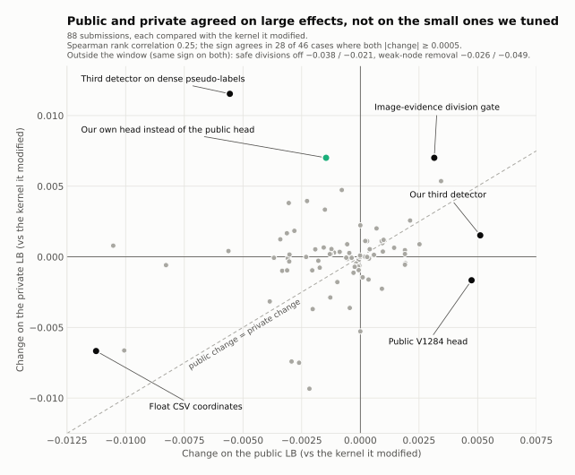

# Lessons

What the final leaderboard taught us, with the evidence. Numbers are Kaggle scores of our own submissions
(public = about 29 % of the hidden test data, private = about 71 %) and offline results on our validation split
(val40: 40 training videos, 20 per embryo, never trained on).

## 1. The public leaderboard was too small to judge 0.001-level decisions

**The own coordinate head.** Every offline measurement preferred our own head to the public V1284 head:

- centre error on val40: 1.712 µm (no head), 1.534 (public), **1.248 (ours)**;
- val40 score of the tracking graph: 0.94152, 0.94210, **0.94535**, and ours ahead in both embryos;
- three seeds of our head, all ahead of the public head in both embryos.

The public LB disagreed: in three paired submissions, our head scored 0.0012-0.0015 *below* the public head. We
followed the public LB and kept the public head (then a 50/50 average). On the private LB our head was **+0.0070**
better in all three pairs. Our best own-head kernel scored 0.93087 private, which would have placed 75th; our final
selection scored 0.92649, 130th.

**It was not an isolated case.** For the 88 submissions that changed a known base kernel:

- the typical disagreement between the public and private change of the same submission (median 0.0017) was larger
  than the typical public change itself (median 0.0015);
- the rank correlation between public and private changes was 0.25;
- where both changes were at least 0.0005, the sign agreed in only 28 of 46 cases.

Examples: the public V1284 head (+0.0047 public, -0.0017 private), a third detector trained on dense
pseudo-labels (-0.0056 public, **+0.0115** private), a three-frame third detector (-0.0008 public, +0.0047 private).

**What we would do differently.** Decide in advance which evidence decides. For a change that is consistent offline
(both embryos, several seeds) and whose public reading is within about 0.002, keep the offline verdict and spend the
final-selection slot on it. We had the right offline evidence for our head on 2026-09-26, three days before the
deadline.

The public subset is about 29 % of the hidden data. We do not know which videos it holds; with few videos, a single
embryo may dominate it. That last point is our inference, not something the hosts stated.

## 2. Node count is a lever whose sign you cannot see offline

The adjusted edge Jaccard multiplies by `1 - 0.1 * (N_pred - N_total) / N_total`, in both directions, so
predicting fewer nodes raises the score. On val40 our pipeline predicts about 0.82 x `N_total`.

| Change | Nodes | val40 | Public | Private |
|---|---|---|---|---|
| Drop weak, isolated nodes (N01) | -11.4 % | +0.0056 | -0.0257 | -0.0490 |
| Detection retention guard off | -4.5 % | not measured | -0.0031 | -0.0010 |
| x138 readmit + gap fill | +0.8 % | not measured | -0.0005 | +0.0003 |
| Oracle: set N_pred = N_total | | -0.0046 | | |

The val40 gain of node removal came almost entirely from the node-count factor, and that factor depends on how many
nuclei the hidden videos really contain. After N01 we treated any node-count change as suspect and kept every
accepted change count-neutral or count-reducing only through better centres.

## 3. Do not change the submission format on a local scorer's word

Writing float coordinates (rounded to 0.01 voxel) instead of integers scored **+0.0029 on val40, in both embryos**,
with the organizer's own evaluation code. On Kaggle it scored **-0.0113 public, -0.0067 private**. The evaluation page
asks for "integer centroid coordinates"; the hosted scorer evidently does not read floats the way the local copy
does (our guess is truncation). Keep the documented format, whatever a local scorer says.

## 4. Division dials are noisy; check them on independent data

Divisions are worth 0.1 x division Jaccard but are rare: val40 holds only 17 ground-truth divisions, and one
division is worth about +0.004 there. Threshold curves read on the public LB were not stable:

| Division-gate pass volume | 0.4x | 0.55x | 0.7x | 1.0x | 1.25x | 1.5x | 2.0x |
|---|---|---|---|---|---|---|---|
| Public | 0.95054 | 0.95270 | 0.95217 | 0.95315 | 0.95336 | **0.95406** | 0.95034 |
| Private | 0.91509 | 0.91897 | 0.92080 | 0.92259 | 0.92371 | 0.92371 | **0.92443** |

The public curve had a cliff at 2.0x that the private set does not have.

## 5. Pre-register holdout checks for small decisions

Twice in the last week we ran the real pipeline on 33 training videos never used for tuning and fixed the decision
rule before looking at the result.

| Decision | Holdout (pre-registered) | Public LB | Private LB |
|---|---|---|---|
| Safe-division gate 9 -> 8 µm | +0.0015 (bootstrap P(gain) 0.83); order 8 > 9 > 7.5 > 7 | +0.0019; 7.5 tied 8 | +0.0002; order 8 > 9 > 7.5 > 7 |
| Prune forks whose brighter child holds > 1.1x the parent's chromatin | +0.0013, 0 true forks lost | -0.0013 | +0.0002 (on both bases) |

Both times the holdout direction matched the private LB and the public LB did not. The pmax holdout reproduced the
private ranking of all four thresholds exactly. We followed it for the gate and against it for the chromatin rule,
which we dropped because of the public reading.

## 6. Measure the error budget before deciding what to build

An oracle study on val40 ([method, section 10](method.md#10-where-the-remaining-error-is-the-oracle-budget)) showed
that the missing score was in links between already-detected cells (+0.078, mostly identity switches between two
parallel tracks) and in divisions (+0.080), while fixing the node count would *lose* 0.005. Before it we had spent
a week on node removal and division filters; after it we built coordinate refinement, the largest late gain
(+0.0047 public for the public head; +0.0070 private for our own head on top of that).

## 7. Make every experiment one verifiable change

The build system ([`kaggle/build_r946.py`](../kaggle/build_r946.py)) made 92 submissions on the 0.946 lineage
traceable: each kernel is the unmodified public notebook plus anchored, default-off patches, and the tests check that
switching a knob changes exactly the intended lines. A byte-identical resubmission (S86-repeat) returned exactly the
same public score, so the hosted run itself was deterministic; the noise in section 1 is sampling of the hidden set,
not run-to-run variation.
