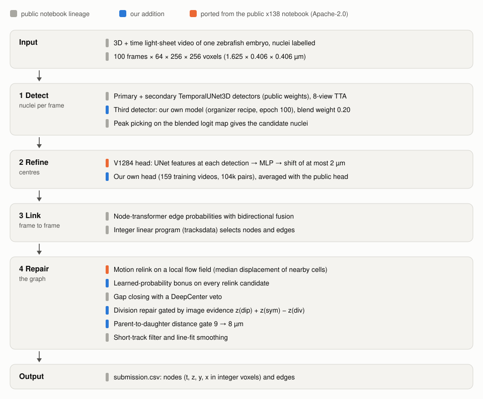
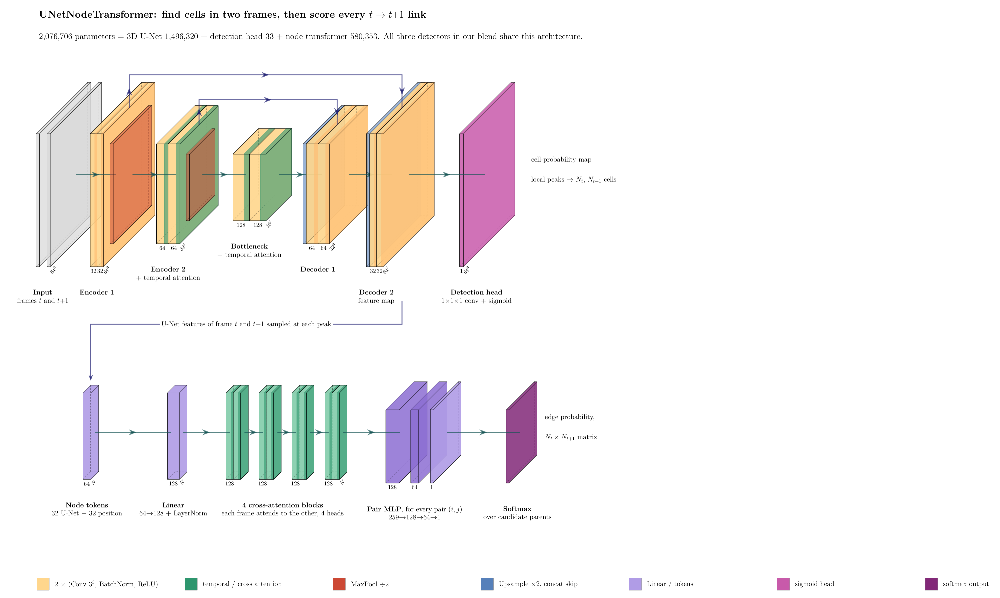
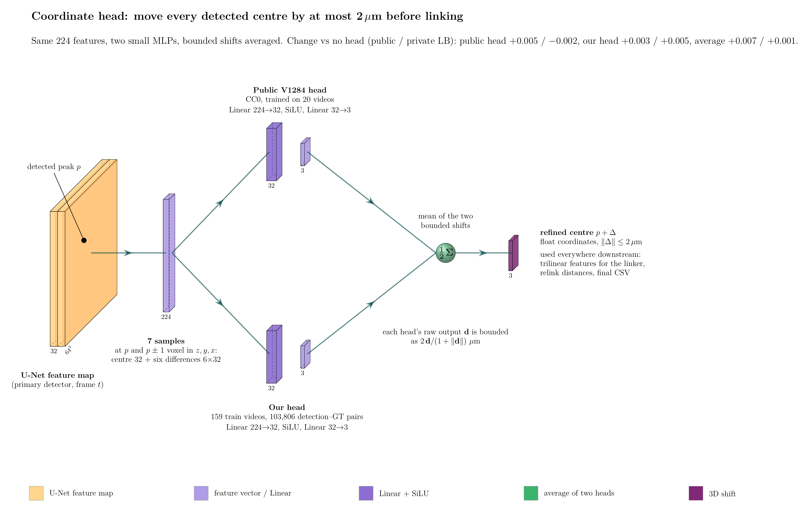
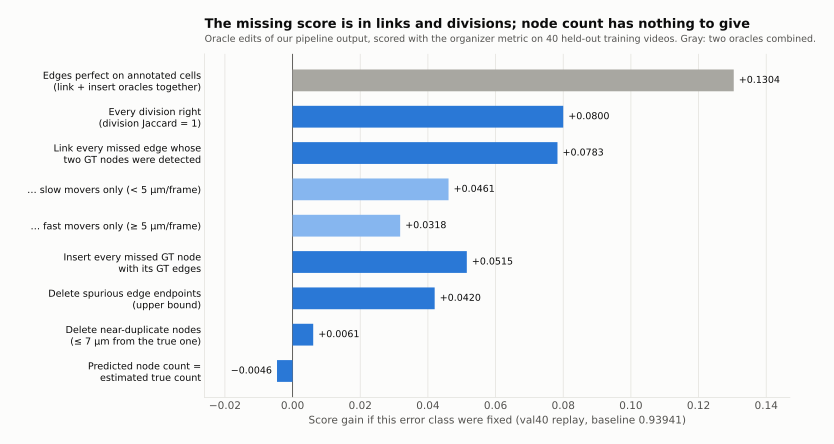

# Method

This document explains every component of the final pipeline: what it does, why we added it, how it is
implemented, and what it did on the leaderboard. Scores are Kaggle values of submitted kernels (public = about 29 %
of the hidden test data, private = about 71 %). "val40" is our offline validation split: 40 training videos
(20 per embryo) held out from all training and replayed through the post-processing offline.

- [1. Problem, data and metric](#1-problem-data-and-metric)
- [2. The public base we started from](#2-the-public-base-we-started-from)
- [3. How we change a public notebook safely](#3-how-we-change-a-public-notebook-safely)
- [4. Third detector](#4-third-detector)
- [5. Image-evidence division gate](#5-image-evidence-division-gate)
- [6. Learned-probability relink bonus](#6-learned-probability-relink-bonus)
- [7. Flow-field relink (ported from x138)](#7-flow-field-relink-ported-from-x138)
- [8. Coordinate refinement: the public V1284 head and our own head](#8-coordinate-refinement-the-public-v1284-head-and-our-own-head)
- [9. Safe-division gate at 8 µm](#9-safe-division-gate-at-8-µm)
- [10. Where the remaining error is: the oracle budget](#10-where-the-remaining-error-is-the-oracle-budget)
- [11. Other modules in this repository](#11-other-modules-in-this-repository)
- [12. Offline dead ends](#12-offline-dead-ends)



## 1. Problem, data and metric

**Task.** Each video is a 3D + time light-sheet recording of a developing zebrafish embryo with fluorescent nuclei.
The goal is a tracking graph: one node per nucleus per frame (t, z, y, x) and an edge from each nucleus to itself, or
to its two daughters, in the next frame.

**Data** (measured on the competition files):

| | |
|---|---|
| Training videos | 199, from two embryos (`44b6`: 71 videos, `6bba`: 128 videos) |
| Video size | 100 frames x 64 x 256 x 256 voxels, uint16 |
| Voxel size | z 1.625 µm, y and x 0.40625 µm (a 104 µm cube) |
| Ground truth | sparse: a median 3.6 % of the nuclei of a video are annotated (0.8 % in `44b6`, 9.7 % in `6bba`) |
| Ground-truth divisions | 151 in all 199 training videos |
| Test | a hidden set scored by re-running the submitted notebook (GPU, internet off, at most 12 hours) |

**Metric** (organizer code, `royerlab/kaggle-cell-tracking-competition`):

```
score = adjusted_edge_jaccard + 0.1 * division_jaccard
adjusted_edge_jaccard = edge_jaccard * (1 - 0.1 * (N_pred - N_total) / N_total)
```

- Predicted nodes are matched to ground-truth nodes per frame by optimal 1:1 assignment within **7 µm**.
- An edge is a true positive when both ends match ground-truth nodes joined by a ground-truth edge. Because the
  ground truth is sparse, predicted edges that touch no annotated lineage are ignored.
- `N_total` is a coarse estimate of the true number of nuclei. The node-count factor acts in **both** directions:
  predicting fewer nodes than `N_total` raises the score. On val40 our pipeline predicts about 0.82 x `N_total`.
- A division counts when a predicted fork recovers a ground-truth division within a one-frame window. The division
  term is small in weight (0.1) but large in practice: switching our division repair off cost -0.038 public.

## 2. The public base we started from

In September we rebased on the public notebook
[Biohub Cell Tracking: 0.946 LB](https://www.kaggle.com/code/reyhanksatria/biohub-cell-tracking-0-947-lb?scriptVersionId=348041532)
(Reyhan Ksatria, Apache-2.0; version 4), itself the end of a public lineage built on pilkwang's public weights. Its
pipeline:

1. **Detection.** Two TemporalUNet3D models (the organizer architecture): a 50-epoch "support pack" primary and a
   400-epoch secondary ("seed 314159"), averaged over 8 dihedral test-time views and blended at weight 0.80 for the
   secondary. Peaks above a threshold become candidate nuclei.
2. **Association.** The organizer's node transformer scores candidate edges between consecutive frames; the
   notebook adds edge-feature test-time augmentation and fuses forward and backward probabilities.
3. **Global selection.** An integer linear program (tracksdata) selects nodes and edges.
4. **Repair.** A motion relink rebuilds most edges with a two-pass Hungarian matching (tight 6 µm, then relaxed
   10 µm), then gap closing, recovery of two-frame gaps, a "safe-division" repair that turns a parent with one child
   into a fork when a free track start sits next to the existing daughter (vetoed by a DeepCenter centre-prior model),
   a short-track filter and line-fit smoothing.


*The organizer's detector/linker model, used by all three detectors in our blend. Drawn in the style of [PlotNeuralNet](https://github.com/HarisIqbal88/PlotNeuralNet).*

Our reproduction of it on the original public weights (S56) scored **0.94489 public / 0.91406 private**.

## 3. How we change a public notebook safely

The base is a single code cell of about 2,900 lines that also writes and patches the organizer's predict script at
run time. Forking and hand-editing it would have made our ~90 single-variable experiments hard to compare. Instead,
[`kaggle/build_r946.py`](../kaggle/build_r946.py) builds every kernel from the unmodified base:

- **Anchored patches.** A patch module holds `(name, old_text, new_text)` pairs. Each `old_text` must occur exactly
  once in the base, otherwise the build fails. Patches that must act on the predict script are embedded as JSON and
  applied at run time inside the kernel, with the same exactly-once check and a `compile()` before writing.
- **Default-off knobs.** Every addition reads an environment knob (`BIOHUB_*`) and is inert when the knob is unset.
  The tests check that an "off" build only adds lines and that switching a knob on changes exactly the intended
  env line (single-variable experiments).
- **Configuration guard.** Overriding a knob also updates the notebook's own `_EXPECTED_*` drift guard, so a kernel
  never dies after hours on a configuration check.
- **Recipes.** [`kaggle/recipes.json`](../kaggle/recipes.json) records the build environment of every milestone
  kernel; `python kaggle/build_recipe.py final-headavg-pmax8 out/` rebuilds the final selection. We checked that
  the rebuilt final notebook sets exactly the 78 knob lines, in the same order, as the submitted kernel.
- **Base pinning.** The builder refuses any base whose code cell does not hash to the version we used.

## 4. Third detector

**What.** A third TemporalUNet3D detector of our own, trained with the organizer's training script and recipe on
all 199 training videos (RunPod GPU; snapshot at epoch 100). Its detection logits are aligned to the primary's mean
and standard deviation and blended sequentially on top of the two public models:

```
det = (1 - w3) * [(1 - w2) * primary + w2 * secondary] + w3 * tertiary      (w2 = 0.80, w3 = 0.20)
```

**Code.** [`kaggle/tertiary_patch_946.py`](../kaggle/tertiary_patch_946.py) (10 runtime anchors on the predict
script; the tertiary runs the same 8-view test-time augmentation).

**Evidence.** S56 -> S57 was a single-variable change: **+0.0051 public, +0.0015 private.** The blend weight showed an
interior optimum on the public LB (0.10: 0.94821, 0.20: 0.95000, 0.30: 0.94769). Swapping the third detector for
other models (a three-frame window model, a 2x XY-resolution model, a synthetic-data pretrained model, a model on
dense pseudo-labels) always lost 0.001-0.006 on the public LB. Several of those swaps were *better* on the private LB
(dense pseudo-labels +0.0115, three-frame epoch 12 +0.0047; see [lessons](lessons.md)).

## 5. Image-evidence division gate

**Problem.** The safe-division repair accepted forks by geometry (distances, a sister-symmetry test and a
divergence test two frames later). Loosening those gates admitted mostly false divisions (S81 -0.008, S82 -0.011).

**What.** We score each candidate fork with image evidence and replace the geometric gates by one combined score:

```
c = z(dip) + z(sym) - z(div)          accept the fork if c <= COMBO_MAX; rank candidates by c
```

- `dip`: brightness along the segment between the existing daughter and the candidate daughter at t+1 (minimum of
  the middle samples / mean of the two ends, after subtracting the local 10th-percentile background). Two real
  sister nuclei show a dark gap; a nucleus detected twice does not. Alone it separates the 151 ground-truth divisions
  from negatives with AUC 0.820, against 0.379 for the distance key used before.
- `sym`: asymmetry of the parent-to-daughter distances.
- `div`: how much the two daughters move apart one frame later.
- `z(.)` standardises each term with constants measured on all training divisions. The combined score reaches
  AUC 0.849.

**Code.** [`kaggle/div_dip_946.py`](../kaggle/div_dip_946.py) (`BIOHUB_DIV_DIP_MODE=4`).

**Evidence.** S57 -> S83 (threshold matched to the old gate's pass volume): **+0.0032 public, +0.0070 private**, the
largest private gain of any single step. We then mapped the threshold on the public LB:

| Pass volume (x S83) | 0.4 | 0.55 | 0.7 | 1.0 | 1.25 | 1.5 | 2.0 |
|---|---|---|---|---|---|---|---|
| Public | 0.95054 | 0.95270 | 0.95217 | 0.95315 | 0.95336 | **0.95406** | 0.95034 |
| Private | 0.91509 | 0.91897 | 0.92080 | 0.92259 | 0.92371 | 0.92371 | **0.92443** |

We kept 1.5x (S86, `BIOHUB_DIV_COMBO_MAX=-2.6659`). The public "cliff" at 2.0x did not exist on the private set.

## 6. Learned-probability relink bonus

**Problem.** The final motion relink rebuilds 99 % of the output edges by geometry. Its cost included the learned
edge probability only for the edge the ILP had chosen; every other candidate pair was scored by distance alone.

**What.** Inside the predict script we capture the node transformer's probability for every candidate pair within
15 µm (the kernel's own blended, test-time-augmented column softmax) and subtract `w * p` from the relink cost of
every pair, with `w = 32`. A reference pass with `w = 0` counts how many assignments changed.

**Code.** [`kaggle/relink_prob_946.py`](../kaggle/relink_prob_946.py) (`BIOHUB_RELINK_PROB_W=32`).

**Evidence.** Offline +0.0020 on val40 (positive in both embryos). S86 -> N05: **+0.0010 public, +0.0012 private.**
The weight is a plateau: 8 gave 0.95449, 32 gave 0.95505, 128 gave 0.95504 public.

## 7. Flow-field relink (ported from x138)

**What.** The public notebook
[x138](https://www.kaggle.com/code/anvithpothula/biohub-0-953-lb-original) (Anvith Pothula, Apache-2.0; slug
`biohub-x138` at the time, now titled "Biohub 0.953 LB | ORIGINAL") replaced the motion relink with a flow-aware one: in each frame pair, confident tight
matches seed a local displacement field (median displacement of the 12 nearest seeds within 40 µm); every source is
then matched against its *predicted* position, with a 7 µm tight gate. We ported its functions verbatim and kept our
probability bonus inside its cost. We also ported its low-detection dump, readmit and gap fill (off in the final
recipe) and added a KD-tree "fast relink" knob that reproduces the original assignment exactly but in seconds.

**Code.** [`kaggle/x138_port_946.py`](../kaggle/x138_port_946.py) (`BIOHUB_MOTION_RELINK_FLOW_MODE=seed` + 12 knobs).

**Evidence.** N05 -> x138flow: **+0.0019 public, +0.0005 private.** The x138 gap fill and readmit (+0.8 % nodes) were
-0.0005 public; a second flow round (FLOW_ITER 2) read +0.0002 public and 0.0000 private and is not in the final
recipe. Flow relink lowers the division count on the four visible test videos (133 -> 108): it claims targets that
the safe-division repair would have used as second daughters.

## 8. Coordinate refinement: the public V1284 head and our own head

**Why.** The oracle budget (section 10) showed that the largest error class is identity switches: a ground-truth
cell lies between two predicted tracks about 8 µm apart and the 7 µm matcher alternates between them. Matched
predicted nodes were 3.6 µm from their ground-truth node at the median for these errors, against 1.7 µm overall.
Better centres attack that directly.

**V1284 head (public).** x138's author released a small coordinate-regression head
([dataset](https://www.kaggle.com/datasets/anvithpothula/biohub-v1284-head-s075), CC0). At each detection it reads the
primary UNet feature map at the centre and at six neighbouring offsets (7 x 32 = 224 features), applies an MLP
224 -> 32 -> 3, and moves the centre by a displacement bounded to 2 µm. We run it in **full mode**: the refined float
coordinates flow through association (trilinear feature lookup), the ILP and all post-processing; only the CSV is
rounded. Code: [`kaggle/v1284_946.py`](../kaggle/v1284_946.py) (`V1284=1`).


*The coordinate head. The final submission averages the bounded shifts of the public V1284 head and our own head.*

- x138flow -> flow-v1284: **+0.0047 public, -0.0017 private.** (A count-neutral "late" variant that only changes
  the CSV coordinates read +0.0025 public, +0.0009 private.)

**Our own head.** The public head was trained on 4,136 pairs from 20 videos. We trained the same architecture on
25x more data:

1. A capture kernel ([`kaggle/coordhead_capture_946.py`](../kaggle/coordhead_capture_946.py)) runs our detection
   recipe on the training videos and stores, for every detection, the exact 224-d feature vector the head reads at
   inference (two Kaggle GPU sessions, about 4 hours each, 199 videos).
2. [`coordhead/train_coordhead.py`](../coordhead/train_coordhead.py) matches detections to ground truth (optimal 1:1
   within 7 µm, pairs kept within 4 µm; the head cannot move a centre more than 2 µm and neighbours sit about 8 µm
   apart), trains the MLP with a Euclidean loss (AdamW, cosine schedule, 40 epochs) and runs 5-fold cross-validation
   by movie.

| Centre error, µm (val40, never trained on) | all | 44b6 | 6bba |
|---|---|---|---|
| No head | 1.712 | 1.499 | 1.779 |
| Public V1284 head | 1.534 | 1.346 | 1.593 |
| **Our head** (159 videos, 103,806 pairs, hidden width 32) | **1.248** | **1.331** | **1.221** |

On the val40 graph replay (head applied to the CSV coordinates), the score went 0.94152 (no head) -> 0.94210 (public)
-> **0.94535 (ours)**, and ours was better than the public head in both embryos.

**What the leaderboard said** (three paired comparisons, same base, full mode):

| Pair | Public LB, own - public head | Private LB, own - public head |
|---|---|---|
| x138flow base | -0.00146 | **+0.00701** |
| two flow rounds | -0.00134 | **+0.00703** |
| two flow rounds + swap repair | -0.00121 | **+0.00706** |

We trusted the public LB and did not select the own-head kernels. As a hedge we averaged the two heads' bounded
displacements (`V1284_HEAD2_DATASET`, "headavg"): **+0.0021 public, +0.0026 private** over the public head. The
second final submission averages the public head with the mean of five own-head seeds
(`V1284_HEAD2_SHA256S`, "headens5"). The best own-head kernel scored **0.93087 private**, which would have placed
75th instead of 130th.

## 9. Safe-division gate at 8 µm

**What.** `BIOHUB_SAFE_DIV_MAX_UM` bounds the parent-to-daughter distance of a repaired fork. 9 -> 8 µm read +0.0019
public twice (on two different bases), 7.5 µm tied 8 µm, and 7 µm fell off a cliff. Because every public reading
shares the same hidden divisions, we checked it on independent data before the final selection.

**Holdout, pre-registered.** We ran the real final pipeline on 33 training videos never used for tuning (72
ground-truth divisions), re-ran only the safe-division step at each threshold (with the as-run notebook code,
including replacement of freed slots and the downstream short-track cleanup), and fixed the decision rule before
looking at the result.

| Gate | Holdout score (change vs 9 µm) | Public LB | Private LB |
|---|---|---|---|
| 9 µm | 0.97979 | 0.96381 | 0.92629 |
| **8 µm** | **0.98129 (+0.0015, P(gain) = 0.83 by video bootstrap)** | 0.96571 | **0.92649** |
| 7.5 µm | 0.97883 (-0.0010) | 0.96571 | 0.92573 |
| 7 µm | 0.97657 (-0.0032) | 0.96178 | 0.92259 |

The holdout ranks the four thresholds in the same order as the private LB (8 > 9 > 7.5 > 7); the public LB could
not separate 7.5 from 8. The (8, 9] µm band was rich in false forks (1 true : 9 false), the (7.5, 8] band was not
(3 : 4).

## 10. Where the remaining error is: the oracle budget

Before the last week we measured, on the val40 replay of the x138flow pipeline (score 0.93941), how much each error
class would be worth if fixed by an oracle that uses the ground truth:



- **Links** between detected ground-truth nodes: +0.078. 70 % of these misses are identity switches between two
  parallel predicted tracks, not missing motion; 95 % of the correct edges were already among the relink candidates.
  This is what pointed us at coordinate refinement.
- **Divisions**: +0.080 if perfect. One recovered division is worth about +0.004 on this split, as much as about
  30 link fixes. But the evaluated pool is small (17 ground-truth divisions in val40), so division decisions are noisy.
- **Detection**: +0.052; the missed nuclei sit 7-9 µm from a predicted node, again a localisation problem.
- **Node count**: setting the predicted count to `N_total` *loses* 0.005, because the metric's node factor rewards
  under-prediction. Every node-removal rule we submitted lost on the leaderboard.

## 11. Other modules in this repository

These were built and tested in the same framework; they are default-off and not part of the final recipe.

| Module | What it does | Leaderboard |
|---|---|---|
| [`node_select_946.py`](../kaggle/node_select_946.py) | Drops weak, isolated nodes (and optional fork pruning). Required in the patch chain; off. | N01 -0.0257 public, -0.0490 private |
| [`swapfix_946.py`](../kaggle/swapfix_946.py) | Re-assigns one-to-one edges per frame pair before smoothing, node-count neutral | -0.0000 public, +0.0001 private |
| [`divfork_946.py`](../kaggle/divfork_946.py) | Metric-aware fork pruning (geometric back-projection, chromatin conservation) | chromatin: -0.0013 public, +0.0002 private |
| [`fastio_946.py`](../kaggle/fastio_946.py) | Direct-path-first input lookup (setup minutes -> seconds), output identical | on in the final recipe |
| [`csvfloat_946.py`](../kaggle/csvfloat_946.py) | Float coordinates in `submission.csv` | -0.0113 public, -0.0067 private |

The chromatin rule was adopted by a pre-registered holdout rule (+0.0013 on the 33-video holdout) and then read
-0.0013 on the public LB; on the private LB it was +0.0002 on both bases where we submitted it.

## 12. Offline dead ends

Ideas that failed on val40 or a training holdout and were never submitted, or were closed after one reading.
Their code lived in our private working repository and is not part of this release.

| Idea | What happened |
|---|---|
| GT-free duplicate removal | A ground-truth oracle deleting near-duplicate nodes was worth +0.028 (S57-era replay), but no GT-free rule recovered it: plain 7 µm proximity deleted 72,055 nodes, 25x the oracle's, and scored -0.022. The detector logit picks the annotated node of a duplicate pair only 68 % of the time. |
| Global ILP cost relaxation | The ILP can never create a fork (division cost 1.2 > maximum edge reward 1). Lowering the division cost to 0.25 created 10,757 forks and scored -0.0008 on all 40 videos; the relink downstream dissolves ILP forks anyway. |
| Division-first reservation | With a perfect selector, reserving both daughters before relinking would add +0.030 on val40. Break-even needs only about 0.1 % precision, but the best GT-free selectors reached 0.02-0.2 % before linking. |
| Learned family / path / action linkers | A training-set oracle showed 413 recoverable links with none lost; the trained models recovered 0-1 and failed their gates. |
| Organizer-lab tracker (HOCT) as a family supplement | -0.014 on 40 development videos, -0.040 on 10 check videos. |
| Selective fork insertion | -0.017 on val40. |

