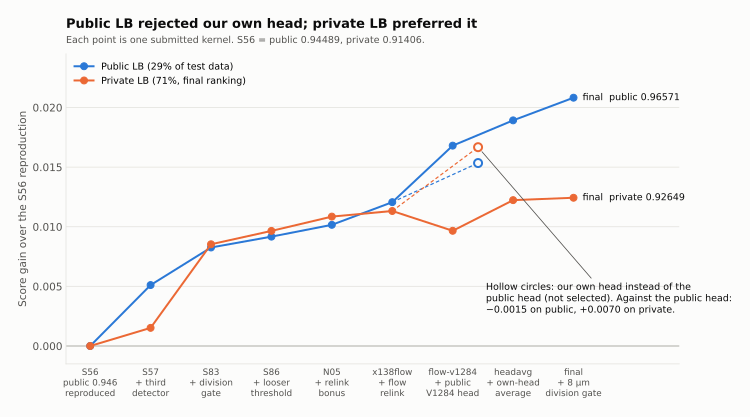
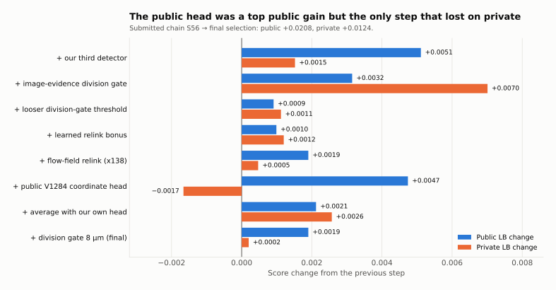

# Results

All scores come from the Kaggle API (`kaggle competitions submissions`). Public = about 29 % of the hidden test data
(shown during the competition), private = about 71 % (final ranking, revealed after the deadline of 2026-09-29).
The leaderboard displayed three decimals; the API returns five. The full list of our 158 submissions, with the
change each one made and its base, is in [`data/submissions.csv`](data/submissions.csv).

## Final standing

**Silver medal**, 130th of 3,947 teams (final standings, private LB 0.92649).

| | Public | Private | Rank (private) |
|---|---|---|---|
| Final selection 1: `headavg-pmax8` | **0.96571** | **0.92649** | **130 / 3,947 teams (silver medal)** |
| Final selection 2: `headens5-pmax8` | 0.96534 | 0.92642 | |
| Best private among our submissions: `iter2-swapfree-ownhead-full` (own head, two flow rounds, swap repair; not selected) | 0.96071 | 0.93087 | would have been 75th |

For scale (final private leaderboard, read 2026-10-03): 1st 0.97759, 7th (last prize) 0.95273, 50th 0.93496,
75th 0.93069, 100th 0.92822. Our four own-head kernels (0.93068-0.93087 private) would have placed 75th-76th:
74 teams scored above 0.93087 and 75 above 0.93068.
Public-to-private drops were common: the team leading the public board at the deadline went from 0.978 to 0.967;
we went from 0.966 to 0.926.

## Three phases

| Phase | Dates (2026) | Submissions | Best public | Best private |
|---|---|---|---|---|
| Own pipeline on the organizer baseline (own NMS, GBDT linker, repair rules; then hybrids) | Aug 18 - Aug 29 | 23 | 0.90252 | 0.89610 |
| Public two-seed stack (pilkwang weights) plus our changes | Aug 22 - Sep 8 | 43 | 0.93455 | 0.90670 |
| Rebase on the public 0.946 notebook ("lane R"), this repository | Sep 8 - Sep 29 | 92 | 0.96571 | 0.93087 |

The organizer baseline scored 0.81006 / 0.81161. In phase 2, our best public kernel gained 0.022 over the copied
public stack on the public LB but only 0.004 on the private LB; the structural rebase in phase 3 moved both.

## The submitted chain to the final selection

Each step is one submitted kernel that changed one thing relative to the previous one.

| Step | Kernel | Public | Private | Public change | Private change |
|---|---|---|---|---|---|
| Reproduce the public 0.946 notebook on the original weights | S56 | 0.94489 | 0.91406 | | |
| + our third detector (weight 0.20) | S57 | 0.95000 | 0.91558 | +0.00511 | +0.00152 |
| + image-evidence division gate | S83 | 0.95315 | 0.92259 | +0.00315 | **+0.00701** |
| + looser gate threshold (1.5x pass volume) | S86 | 0.95406 | 0.92371 | +0.00091 | +0.00112 |
| + learned-probability relink bonus | N05 | 0.95505 | 0.92491 | +0.00099 | +0.00120 |
| + flow-field relink (ported from x138) | x138flow | 0.95695 | 0.92538 | +0.00190 | +0.00047 |
| + public V1284 coordinate head, full mode | flow-v1284 | 0.96169 | 0.92372 | +0.00474 | **-0.00166** |
| + average with our own head | flow-v1284-headavg | 0.96381 | 0.92629 | +0.00212 | +0.00257 |
| + safe-division gate 9 -> 8 µm (final) | headavg-pmax8 | **0.96571** | **0.92649** | +0.00190 | +0.00020 |
| *Total* | | | | *+0.02082* | *+0.01243* |

## Important submissions by theme

Changes are relative to the base kernel named in the second column.

**Detection**

| Kernel | Base | Change | Public | Private |
|---|---|---|---|---|
| S57 | S56 | + our third detector, weight 0.20 | +0.00511 | +0.00152 |
| S65 / S67 | S57 | third-detector weight 0.30 / 0.10 | -0.00231 / -0.00179 | -0.00001 / -0.00028 |
| S68 | S57 | third detector epoch 100 -> 150 | +0.00035 | -0.00161 |
| S73 | S57 | third detector trained on dense pseudo-labels | -0.00556 | **+0.01154** |
| S76 | S57 | primary 50-epoch -> 350-epoch public weights | -0.00293 | -0.00741 |
| S100 | S86 | third detector = three-frame window model, epoch 12 | -0.00079 | **+0.00473** |
| X2-EP5 | S86 | third detector on a 2x XY grid, epoch 5 | -0.00305 | +0.00381 |
| synthdet16 | N05 | third detector pretrained on synthetic data | -0.00368 | -0.00007 |
| T01 | S86 | test-time augmentation = training flip set | -0.01006 | -0.00663 |

**Divisions**

| Kernel | Base | Change | Public | Private |
|---|---|---|---|---|
| S80 | S57 | safe-division repair off | -0.03782 | -0.02126 |
| S81 / S82 | S57 | looser symmetry / divergence gates | -0.00828 / -0.01053 | -0.00059 / +0.00079 |
| S83 | S57 | image-evidence combo gate | +0.00315 | +0.00701 |
| S86 / S89 | S83 | combo pass volume 1.5x / 2.0x | +0.00091 / -0.00281 | +0.00112 / +0.00184 |
| S91 / S92 / S97 | S86 | metaphase-plate orientation and opening-angle terms | -0.00309 / -0.00192 / -0.00341 | -0.00011 / +0.00053 / +0.00124 |
| N06 (0.60 / 0.40) | N05 | learned division veto, prune 17 % / 25 % of forks | 0.00000 / -0.00217 | -0.00528 / -0.00934 |
| flowdivsafe | x138flow | flow relink may not take division daughters | -0.00205 | -0.00096 |
| flow-v1284-pmax8 | flow-v1284 | safe-division gate 9 -> 8 µm | +0.00192 | -0.00046 |
| headavg-pmax8 / -pmax75 / -pmax7 | headavg | gate 8 / 7.5 / 7 µm | +0.00190 / +0.00190 / -0.00203 | +0.00020 / -0.00056 / -0.00370 |
| headavg-pmax8-chroma | headavg-pmax8 | prune forks whose brighter child > 1.1x parent chromatin | -0.00130 | +0.00019 |

**Linking**

| Kernel | Base | Change | Public | Private |
|---|---|---|---|---|
| X01 | S86 | tight relink gate 6.0 -> 5.5 µm | -0.00024 | -0.00071 |
| N05 | S86 | learned-probability relink bonus, w = 32 | +0.00099 | +0.00120 |
| N05-rw8 / N05-rw128 | N05 | bonus weight 8 / 128 | -0.00056 / -0.00001 | -0.00015 / -0.00001 |
| motion-gate | N05 | bulk-motion gate and prediction | +0.00096 | +0.00037 |
| x138flow | N05 | flow-field relink | +0.00190 | +0.00047 |
| x138gap | N05 | x138 readmit + gap fill (+0.8 % nodes) | -0.00047 | +0.00027 |
| flow-iter2 / iter3 | x138flow | two / three flow rounds | +0.00020 / +0.00029 | +0.00001 / -0.00001 |
| flow-tight8 | x138flow | flow tight gate 7 -> 8 µm | -0.00333 | -0.00099 |
| iter2-swapfree-v1284 | iter2-v1284 | one-to-one swap repair before smoothing | -0.00001 | +0.00009 |

**Coordinates**

| Kernel | Base | Change | Public | Private |
|---|---|---|---|---|
| x138flow-csvfloat | x138flow | float coordinates in submission.csv | -0.01126 | -0.00667 |
| flow-v1284late | x138flow | public V1284 head, CSV coordinates only | +0.00251 | +0.00088 |
| flow-v1284 | x138flow | public V1284 head, full mode | +0.00474 | -0.00166 |
| flow-ownhead | flow-v1284 | our own head instead of the public head | -0.00146 | **+0.00701** |
| iter2-ownhead | iter2-v1284 | our own head instead of the public head | -0.00134 | +0.00703 |
| flow-v1284-headavg | flow-v1284 | average of public and own head | +0.00212 | +0.00257 |
| headens5-pmax8 | headavg-pmax8 | 0.5 public + 0.5 mean of five own-head seeds | -0.00037 | -0.00007 |

**Node count**

| Kernel | Base | Change | Public | Private |
|---|---|---|---|---|
| N01 | S86 | drop weak, isolated nodes (-11.4 % nodes) | -0.02565 | -0.04904 |
| flow-v1284-noguard | flow-v1284 | detection retention guard off (-4.5 % nodes) | -0.00310 | -0.00096 |
| S86-repeat | S86 | byte-identical resubmission | 0.00000 | 0.00000 |

## Public and private changes, all single-change submissions

For the 88 submissions that changed a known base kernel, the rank correlation between the public change and the
private change is 0.25. Where both changes were at least 0.0005, the sign agreed in 28 of 46 cases. Large effects
(safe divisions off, node removal, float coordinates, the first division gate) agreed; the 0.001-0.003 decisions we
spent most of our submissions on did not. See [lessons](lessons.md).

## Final selection, as decided on 2026-09-29

We selected the two best public kernels, both with the holdout-validated 8 µm gate and a head ensemble:
`headavg-pmax8` (public 0.96571) and `headens5-pmax8` (0.96534). A hedge that swapped the second one for
`flow-v1284-pmax8` was considered and dropped; it scored 0.92326 private. The own-head kernels (0.93068-0.93087
private) were not candidates because each read 0.0012-0.0015 below its public-head twin on the public LB.
